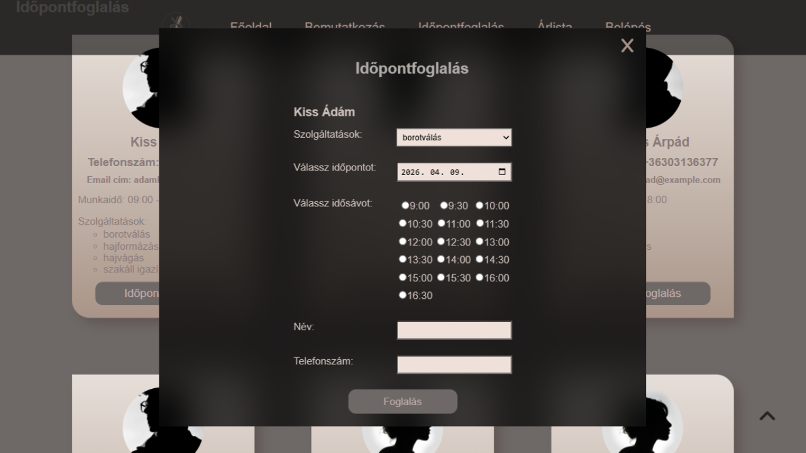
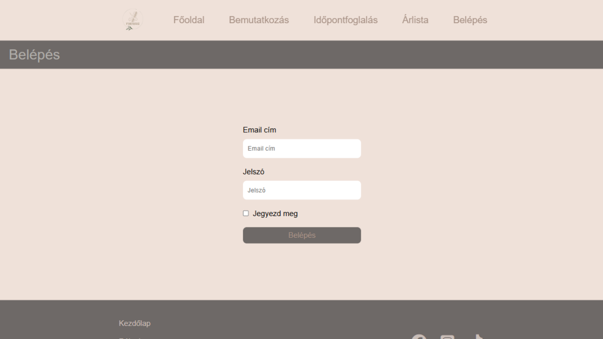
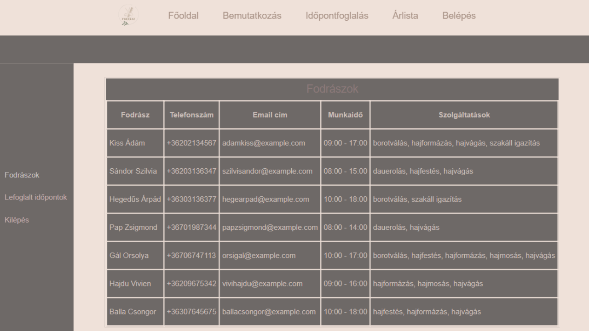
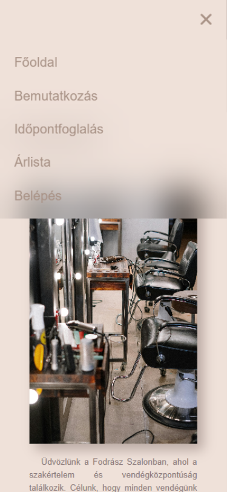
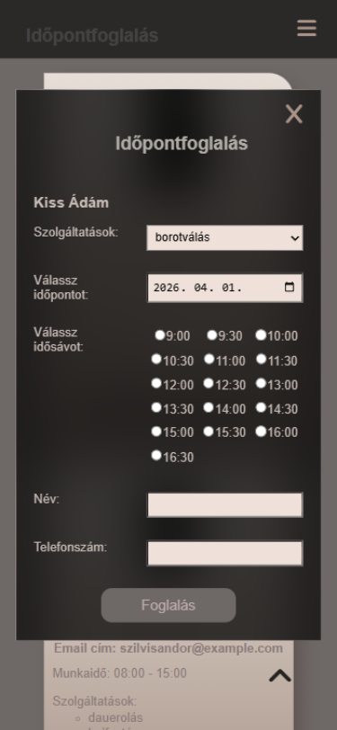
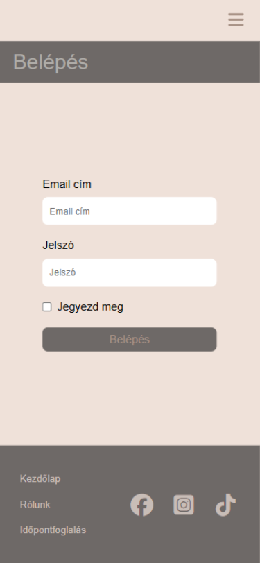
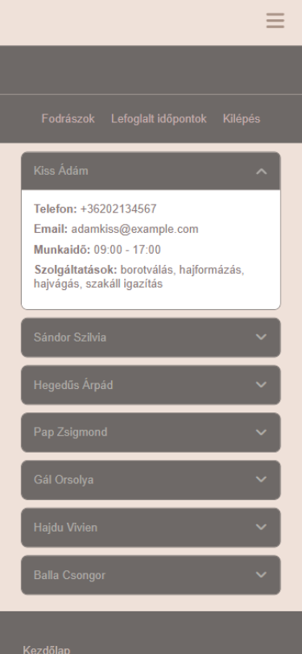

<p align="right">
  🌐 <a href="README_EN.md">English version</a>
</p>

# Fodrász Szalon – Időpontfoglaló és Adminisztrációs Rendszer

**Nyelv:** HU Magyar | [GB English](README_EN.md)

## Képernyőképek

### Asztali nézet
| Főoldal | Időpontfoglalás | Admin belépés | Admin Dashboard |
|:---:|:---:|:---:|:---:|
|  |  |  |  |

### Mobil nézet
| Főoldal | Időpontfoglalás | Admin belépés | Admin Dashboard |
|:---:|:---:|:---:|:---:|
|  |  |  |  |

Ez a projekt egy fiktív fodrász szalon teljes körű weboldala, amely tartalmaz egy nyilvános időpontfoglaló felületet a vendégek számára, valamint egy védett adminisztrációs felületet a szalon dolgozói számára.

A fejlesztés során kiemelt figyelmet fordítottam a Mobile First szemléletre, a biztonságos autentikációra (JWT) és a moduláris kódfelépítésre.

---

## Főbb funkciók

### Vendég oldal 

- **Reszponzív bemutatkozó oldal:** Teljes körű tájékoztatás a szalonról és szolgáltatásokról.
- **Dinamikus árlista:** Az árak közvetlenül az adatbázisból töltődnek be.
- **Interaktív időpontfoglalás:** Fodrász kiválasztása.
    - **Valós idejű idősáv generálás** (30 perces bontásban).
    - **Foglalt időpontok automatikus szűrése** (nem lehet két foglalás ugyanarra az időpontra).
    - **Kliensoldali validáció reguláris kifejezésekkel.**

### Admin felület

- **Biztonságos belépés:** JWT (JSON Web Token) alapú hitelesítés HttpOnly sütikkel.
- **Dashboard:** Átlátható felület a lefoglalt időpontok és a fodrászok adatainak kezelésére.
- **CRUD előkészítés:** Az adatok rendszerezett, táblázatos megjelenítése API végpontokon keresztül.

## Technológiai stack

### Backend
- **Node.js & Express:** A szerveroldali logika és az API kiszolgálása.
- **PostgreSQL:** Relációs adatbázis az adatok perzisztens tárolására.
- **JWT (jsonwebtoken):** Token-alapú hitelesítés.
- **Bcryptjs:** Jelszavak biztonságos hashelése.

### Frontend
- **EJS (Embedded JavaScript):** Dinamikus HTML sablonkezelés.
- Vanilla JavaScript **(ES6+ Modules):** Moduláris felépítésű kliensoldali logika.
- **CSS3 (Flexbox & Grid):** Teljesen reszponzív kialakítás, külön fájlokba bontott töréspontokkal.

## Telepítés és beállítás

1. Repo klónozása:

```text
git clone [repo-url]
```

2. Függőségek telepítése:

```text
npm install
```

3. Környezeti változók:

Másold le a `.env.example` fájlt `.env` néven, és töltsd ki a saját adataiddal:

```text
DB_USER=your_user
DB_HOST=localhost
DB_NAME=your_db_name
DB_PASSWORD=your_password
DB_PORT=5432
JWT_SECRET=your_super_secret_key
MY_API_KEY=your_api_key_for_backend_communication
```

4. Adatbázis inicializálása:
- Hozd létre az adatbázis szerkezetét és töltsd be az alapértelmezett tesztadatokat a projekt gyökerében található hair_salon.sql fájl futtatásával.
- Ez a lépés automatikusan létrehozza a táblákat, a szolgáltatásokat, a fodrászokat és az alapértelmezett adminisztrátori fiókot is.

5. Indítás: 

```text
node index.js  # Frontend szerver (port 3000)
node api.js    # API szerver (port 4000)
```

## Projekt felépítése (Fontosabb fájlok)

- index.js: A fő alkalmazás és az útvonalak kezelése.
- api.js: Az adatbázis-műveleteket végző API végpontok.
- views/: EJS template-ek (header, footer, login, admin).
- public/assets/modules/: Újrafelhasználható JS modulok (validáció, idősáv generálás, API kommunikáció).
- public/assets/styles/: Reszponzív CSS architektúra.

## Adminisztrációs hozzáférés (Tesztelés)

A projekt biztonsági okokból nem tartalmaz előre definiált jelszavakat a forráskódban. A rendszer `bcryptjs` alapú hashelést használ a jelszavak védelmére.

A teszteléshez a következő módon tudsz belépni:
1. **Alapértelmezett felhasználó:** Az adatbázis inicializálása (`hair_salon.sql`) során létrejön egy `admin@example.com` email címmel rendelkező teszt fiók.
2. **Jelszó:** A teszteléshez használható jelszó: **admin123**. 
Ez a jelszó a `hair_salon.sql` script futtatásával kerül be az adatbázisba (titkosított formában). A belépés után a rendszer JWT-alapú munkamenetet indít.
3. **Munkamenet:** A sikeres bejelentkezés után a rendszer JWT-t generál, melyet HttpOnly sütiben tárol a biztonságos böngészés érdekében.

## Készítette
Név: Lukács Zita
Dátum: 2025. szeptember